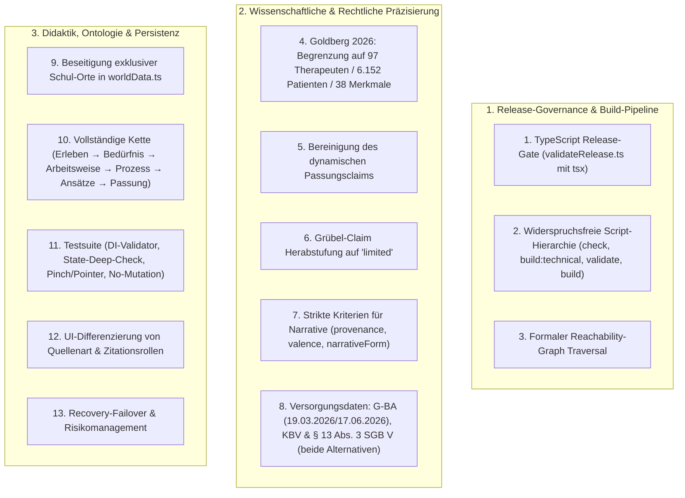

# Korrekturplan V2: Audit-Behebung & Strikte Release-Härtung

> **Dokumentenversion:** 2.0  
> **Projekt:** Landkarte der Psychotherapie  
> **Basis-Commit:** `8006cc43892208238eaae461715e7a9f1bba417b`  
> **Status:** Verbindlicher Korrekturplan zur formalen Freigabe (Stopppunkt vor Implementierung)  
> **Regel:** In dieser Phase werden **keine Programmdateien verändert**.

---

## Übersicht der 13 Korrekturpunkte



---

## 1. Echter Release-Gate mit TypeScript (`validateRelease.ts` via `tsx`)

### 1.1 Betroffene Dateien
* `package.json`
* `scripts/validateRelease.ts` (Neu)
* `src/validation/validateKnowledge.ts`

### 1.2 Geplante Datenmodell- & Skript-Architektur
* Aufnahme von `tsx` in `devDependencies` von `package.json`.
* Implementierung von `scripts/validateRelease.ts` in nativer TypeScript-Syntax.
* **Widerspruchsfreie Script-Hierarchie:**
  ```json
  "scripts": {
    "dev": "vite",
    "check:technical": "tsc --noEmit && vitest run",
    "test": "vitest run",
    "test:knowledge": "vitest run tests/knowledgeValidation.test.ts",
    "build:technical": "tsc && vite build",
    "validate:release": "tsx scripts/validateRelease.ts",
    "build": "tsc && vitest run && tsx scripts/validateRelease.ts && vite build"
  }
  ```
* **Ausführungsreihenfolge in `npm run build`:**
  1. `tsc` (Statische Typprüfung)
  2. `vitest run` (Unit- & Validierungstests)
  3. `tsx scripts/validateRelease.ts` (Strikter Release-Gate)
  4. `vite build` (Bundle-Erzeugung **nur** bei Erfolg der Schritte 1–3)

### 1.3 Reachability Traversal Definition
Ein Claim gilt als **erreichbar**, wenn er über mindestens einen der folgenden 6 Pfade referenziert wird:
1. **Route-Trigger:** `ExplorationRoute.triggerNodeId -> KnowledgeNode.claimIds`
2. **Routenzielknoten:** `RouteOption.targetKnowledgeNodeIds -> KnowledgeNode.claimIds`
3. **Erreichbare Relationen:** `KnowledgeRelation.claimIds` (sofern Source- oder Target-Node erreichbar ist)
4. **Szenen-Dialoge:** `Scene.hotspots[].dialogue.claimIds` & `subtextClaimIds`
5. **Verschachtelte Aktionen:** `HotspotAction.claimIds`, `QuizPayload.explanationClaimIds`, `ItemPayload.claimIds`
6. **Geografie & Didaktik:** `LocationNode.teaserClaimIds`, `LocationNode.knowledgeNodeIds -> KnowledgeNode.claimIds`, `ExplorationRoute.disclaimerClaimIds`, `RouteOption.perspectiveClaimIds`

*Verhalten des Release-Gates:*
Findet `validateRelease.ts` erreichbare Claims mit `reviewStatus: 'draft'` oder Validierungsfehler, bricht das Skript mit `process.exit(1)` ab.

### 1.4 Migration & Rückwärtskompatibilität
* `build:technical` erlaubt weiterhin Entwicklungs-Builds; `build` schützt vor unfertigen Releases.

### 1.5 Konkrete automatisierte Akzeptanztests
* `tests/knowledgeValidation.test.ts`: Test prüft, dass der Report `releaseStatus === 'BLOCKED_BY_DRAFT_CONTENT'` zurückgibt, solange erreichbare Drafts existieren.
* Test prüft, dass unreferenzierte Draft-Claims das Release nicht blockieren.

### 1.6 Erwartete Kommando-Ausgaben und Exit-Codes
* `npm test`: **Exit 0**
* `npm run check:technical`: **Exit 0**
* `npm run build:technical`: **Exit 0**
* `npm run build`: **Exit 1** (`[RELEASE GATE FAILED] 7 erreichbare Claims im Status 'draft'. Release blockiert: BLOCKED_BY_DRAFT_CONTENT`)

### 1.7 Risiken & bewusst nicht bearbeitete Punkte
* Kein automatisches Überschreiben von Drafts auf Approved ohne Originalprüfung.

---

## 2. Wissenschaftliche Quellenkorrektur (Goldberg et al., 2026)

### 2.1 Betroffene Dateien
* `src/data/knowledge/sources.ts`
* `src/data/knowledge/claims.ts`
* `src/data/knowledge/nodes.ts`
* `src/data/knowledge/relations.ts`

### 2.2 Geplante Datenmodell- & API-Änderungen
* **Exakter Datensatz in `sources.ts`:**
  ```typescript
  {
    id: 'src_goldberg_2026_therapist_characteristics',
    kind: 'primary-study',
    title: 'Multimodal Assessments of Therapist Characteristics Are Largely Unrelated to Patient Outcomes: A Preregistered Analysis',
    authors: 'Goldberg, S. B., et al.',
    year: 2026,
    venue: 'Clinical Psychological Science',
    doi: '10.1177/21677026261424222',
    peerReviewed: true
  }
  ```
* **Neuer eng begrenzter Claim in `claims.ts`:**
  ```typescript
  {
    id: 'claim_therapist_characteristics_null_finding',
    type: 'association',
    statement: 'Umfassende Vorab-Erhebungen statischer Therapeutenmerkmale zeigen weitgehend keine statistische Vorhersagekraft für das spätere Therapieergebnis.',
    publicExplanation: 'In einer präregistrierten Analyse mit 97 Therapeutinnen/Therapeuten und 6.152 Patientinnen/Patienten sagten 38 multimodale Vorab-Merkmale (Persönlichkeit, Bindungsstil, soziale Kompetenzen) den Behandlungserfolg kaum vorher (Goldberg et al., 2026). Statische Therapeutenprofile bieten daher keine verlässliche Basis für automatisierte Zuweisungen.',
    citations: [
      {
        sourceId: 'src_goldberg_2026_therapist_characteristics',
        role: 'supports',
        locator: 'S. 1–18, insb. Tabellen 2 & 3',
        note: 'Präregistrierte Nullbefunde zu 38 statischen Therapeutenmerkmalen'
      }
    ],
    evidenceLevel: 'limited', // Begrenzt auf die untersuchten statischen Merkmale
    reviewStatus: 'draft',
    limitations: 'Untersuchte ausschließlich Therapeutenmerkmale vor Therapiebeginn; keine Aussage über dynamische Prozessmerkmale oder Problem-Treatment-Matching.'
  }
  ```
* **Korrektur von `claim_fit_collaboration_dynamic`:**
  * Goldberg 2026 wird **vollständig entfernt**, da keine direkte empirische Kausalitäts- oder Stützungsbeziehung für dynamische Passung besteht. Der Claim verbleibt als rein konzeptioneller Prozessclaim (`evidenceLevel: 'not-applicable'`, gestützt auf Alliance-Basisliteratur).
* **Korrektur von `claim_evidence_perspectives`:**
  * Definitions- und Konzeptclaims erhalten `evidenceLevel: 'not-applicable'`, da epistemische Rahmenmodelle keine Wirksamkeitsstudien sind.

### 2.3 Migration & Rückwärtskompatibilität
* Konsistente Typanpassung ohne Bruch.

### 2.4 Konkrete automatisierte Akzeptanztests
* Test validiert Titel, DOI und Metadaten von `src_goldberg_2026_therapist_characteristics`.
* Test stellt sicher, dass `claim_fit_collaboration_dynamic` keine Zitation von Goldberg 2026 mehr enthält.
* Test prüft, dass Claims vom Typ `definition` oder `theory` nicht fälschlich als `well-supported` deklariert sind.

### 2.5 Erwartete Kommando-Ausgaben
* `npm test`: **Exit 0**.

### 2.6 Risiken & bewusst nicht bearbeitete Punkte
* Keine unzulässigen Verallgemeinerungen gegen patientenseitiges Problem-Matching.

---

## 3. Bereinigung von Narrativen und internen Berichten

### 3.1 Betroffene Dateien
* `src/types/content.ts`
* `src/data/knowledge/sources.ts`
* `src/data/knowledge/claims.ts`
* `src/validation/validateKnowledge.ts`

### 3.2 Geplante Datenmodell- & API-Änderungen
* **Erweiterung von `SourceRecord`:**
  ```typescript
  export type NarrativeValence = 'positive' | 'negative' | 'mixed';

  export interface SourceRecord {
    // ...
    valence?: NarrativeValence; // Verpflichtend bei kind === 'patient-narrative'
    provenance?: string;        // Verpflichtende Herkunft/Erhebungskontext
  }
  ```
* **Vollständige Entfernung:**
  * `src_narrative_rumination_action_2025` wird restlos aus `sources.ts` und `claims.ts` gelöscht.
* **Herabstufung von `claim_action_oriented_rumination`:**
  * Statement: *„Handlungsorientierte Übungen und konkretes Erproben können im therapeutischen Prozess helfen, repetitive Gedankenschleifen zu unterbrechen.“*
  * Evidenzstufe wird von `well-supported` auf **`limited`** herabgestuft, gestützt ausschließlich auf Standardliteratur (`src_grawe_1997`, Problembewältigung S. 420–445).
* **Validierungsregel:**
  * Narrative dürfen ausschließlich bei Claims vom Typ `experience` mit `role: 'supports'` verwendet werden.

### 3.3 Migration & Rückwärtskompatibilität
* Rückwärtskompatibel.

### 3.4 Konkrete automatisierte Akzeptanztests
* Test wirft `ERROR`, wenn eine narrative Quelle keine `valence`, `narrativeForm` oder `provenance` besitzt.
* Test wirft `ERROR`, wenn ein Narrativ als `supports` an einem Claim mit `type: 'effectiveness'` oder `evidenceLevel: 'well-supported'` hängt.

### 3.5 Erwartete Kommando-Ausgaben
* `npm test`: **Exit 0**.

### 3.6 Risiken & bewusst nicht bearbeitete Punkte
* Vorläufiger Verzicht auf ungesicherte Erfahrungsstimmen bis zur Einbindung echter Primärstudien.

---

## 4. Korrektur der Versorgungsdaten (G-BA, KBV & § 13 Abs. 3 SGB V)

### 4.1 Betroffene Dateien
* `src/data/knowledge/sources.ts`
* `src/data/knowledge/claims.ts`
* `src/validation/validateKnowledge.ts`

### 4.2 Geplante Datenmodell- & API-Änderungen
* **G-BA Quelle (`src_gba_psychotherapie_richtlinie`):**
  * `venue`: `'Bundesanzeiger BAnz AT 16.06.2026 B1, Beschluss vom 19.03.2026, in Kraft getreten am 17.06.2026'`
  * `url`: `'https://www.g-ba.de/richtlinien/20/'`
  * `validFrom`: `'2017-04-01'`
  * `lastCheckedAt`: `'2026-03-01'`
  * `jurisdiction`: `'DE'`
* **KBV Quelle (`src_kbv_terminservicestelle_2024`):**
  * `title`: *„Kassenärztliche Bundesvereinigung: Psychotherapeutische Versorgung und Terminservicestelle 116 117“*
  * `url`: `'https://www.kbv.de/html/themen_1120.php'`
  * `jurisdiction`: `'DE'`
  * `lastCheckedAt`: `'2026-03-01'`
* **Korrektur von `claim_care_funding_paths` (§ 13 Abs. 3 SGB V):**
  * Das Gesetz wird in seinen **zwei getrennten Alternativen** präzise dargestellt:
    1. *Alternative 1 (Unaufschiebbare Leistung):* Die Krankenkasse konnte eine unaufschiebbare Leistung nicht rechtzeitig erbringen.
    2. *Alternative 2 (Rechtswidrige Ablehnung):* Eine Leistung wurde von der Krankenkasse zu Unrecht abgelehnt.
  * Voraussetzung: Vorherige Antragstellung, Dokumentation der Systemversagens und Ablehnungsbescheid vor Behandlungsbeginn.

### 4.3 Migration & Rückwärtskompatibilität
* Reine Datenpräzisierung.

### 4.4 Konkrete automatisierte Akzeptanztests
* Test prüft, dass alle Quellen mit `kind: 'official'` gültige `url`, `jurisdiction` (`DE`) und `lastCheckedAt` besitzen.
* Test prüft, dass `claim_care_funding_paths` die Fundstelle `§ 13 Abs. 3 Satz 1 SGB V` nennt.

### 4.5 Erwartete Kommando-Ausgaben
* `npm test`: **Exit 0**.

### 4.6 Risiken & bewusst nicht bearbeitete Punkte
* Spezifische Landes-Kostenerstattungsrichtlinien werden nicht als bundesweites Recht dargestellt.

---

## 5. Beseitigung exklusiver Schul-Orte in `worldData.ts` & vollständige Wissenskette

### 5.1 Betroffene Dateien
* `src/data/worldData.ts`
* `src/data/knowledge/nodes.ts`
* `src/data/knowledge/relations.ts`
* `src/data/exploration/routes.ts`
* `src/validation/validateKnowledge.ts`

### 5.2 Geplante Datenmodell- & API-Änderungen
* **Entfernung exklusiver Schul-Zuordnungen in `worldData.ts`:**
  * Bisher: Option 2 (Muster verstehen) verwies auf `loc_teaser_psychoanalysis`.
  * **Korrektur:** Schauplätze besitzen keine exklusiven Arbeitsweisen. Arbeitsweisen (z. B. konkretes Ausprobieren, Muster verstehen) sind schulenübergreifend.
  * `worldData.ts` ordnet den Schauplätzen über `knowledgeNodeIds` jeweils die dort tatsächlich behandelten Interventionen, Prozesse und Ansätze zu, ohne eine 1:1-Gleichsetzung von Arbeitsweise = Ort zu erzeugen.
* **Entfernung der 4 unvollständigen `bookmarkId`s:**
  * In `routes.ts` erhalten Optionen 2 bis 5 `bookmarkId: undefined`.
  * Nur Option 1 behält `bookmarkId: 'bm_initial_interview_question_action'`.
* **Vollständige Kette mit konkreten IDs:**
  ```text
  1. Subjektives Erleben:
     - node_exp_constant_rumination ("Ständiges Grübeln")
  
  2. Bedürfnis- & Zielebene (NEU):
     - node_need_structure_coping ("Wunsch nach konkreter Handlungsfähigkeit")
     - node_need_understanding_causes ("Wunsch nach Verstehen tieferer Ursachen")
     - node_need_emotional_relief ("Wunsch nach emotionaler Entlastung")
  
  3. Gewünschte Arbeitsweisen (Kompass-Optionen):
     - node_wm_concrete_action ("Konkrete Strategien ausprobieren")
     - node_wm_deep_patterns ("Tiefere Muster erforschen")
     - node_wm_thought_distance ("Gedankenabstand gewinnen")
     - node_wm_body_emotion ("Körper & Gefühle einbeziehen")
     - node_wm_social_context ("Beziehungen & Umfeld betrachten")
  
  4. Prozesse & Interventionen:
     - node_proc_behavioral_activation ("Verhaltensaktivierung")
     - node_proc_schema_exploration ("Klärung biografischer Schemata")
     - node_proc_defusion ("Kognitive Defusion")
     - node_tech_behavioral_experiment ("Verhaltensexperimente")
     - node_tech_chair_work ("Stuhldialoge")
     - node_tech_systemic_tasks ("Systemische Beobachtungsaufgaben")
  
  5. Therapieansätze (als methodenübergreifende Traditionen):
     - node_app_cbt ("KVT")
     - node_app_psychodynamic ("Psychodynamische Psychotherapie")
     - node_app_systemic ("Systemische Therapie")
     - node_app_humanistic ("Humanistische Verfahren")
  
  6. Reale Zusammenarbeit & Passungsprüfung:
     - node_collab_fit_examination ("Gemeinsame Passungsprüfung im Erstgespräch")
     - node_collab_therapeutic_alliance ("Therapeutische Allianz")
  ```
* **Spezifische Relationen mit IDs:**
  * `rel_rumination_to_need_coping` (`node_exp_constant_rumination` -> `node_need_structure_coping`, `acts-via`)
  - `rel_need_coping_to_wm_action` (`node_need_structure_coping` -> `node_wm_concrete_action`, `implements`)
  - `rel_action_to_behavioral_exp` (`node_tech_behavioral_experiment` -> `node_wm_concrete_action`, `implements`)
  - `rel_action_to_chair_work` (`node_tech_chair_work` -> `node_wm_concrete_action`, `implements`)
  - `rel_action_to_systemic_tasks` (`node_tech_systemic_tasks` -> `node_wm_concrete_action`, `implements`)
  - `rel_exp_to_cbt` (`node_tech_behavioral_experiment` -> `node_app_cbt`, `belongs-to`)
  - `rel_chair_to_humanistic` (`node_tech_chair_work` -> `node_app_humanistic`, `belongs-to`)
  - `rel_tasks_to_systemic` (`node_tech_systemic_tasks` -> `node_app_systemic`, `belongs-to`)
  - `rel_action_to_fit` (`node_wm_concrete_action` -> `node_collab_fit_examination`, `examines-fit`)
  - `rel_fit_to_alliance` (`node_collab_fit_examination` -> `node_collab_therapeutic_alliance`, `examines-fit`)

### 5.3 Migration & Rückwärtskompatibilität
* Rückwärtskompatibel.

### 5.4 Konkrete automatisierte Akzeptanztests
* Test stellt sicher, dass `RouteOption.targetKnowledgeNodeIds` keine `approach`-Knoten enthält.
* Test validiert, dass die vollständige Kette über Relationen auflösbar ist.

### 5.5 Erwartete Kommando-Ausgaben
* `npm test`: **Exit 0**.

### 5.6 Risiken & bewusst nicht bearbeitete Punkte
* Keine.

---

## 6. Validator mit Dependency Injection & echte Negativtests

### 6.1 Betroffene Dateien
* `src/validation/validateKnowledge.ts`
* `tests/knowledgeValidation.test.ts`

### 6.2 Geplante Datenmodell- & API-Änderungen
* `validateKnowledgeGraph(customData?: KnowledgeDatasets)` erlaubt das Injizieren beliebiger Testdatensätze.
* **Echte Negativtests in `tests/knowledgeValidation.test.ts`:**
  1. `test('rejects duplicate source IDs')`
  2. `test('rejects claims with missing source references')`
  3. `test('rejects route options pointing directly to approach nodes')`
  4. `test('rejects patient narrative used as supports for effectiveness claim')`
  5. `test('rejects official sources without jurisdiction or url')`
  6. `test('rejects scenes referencing non-existent location IDs')`
  7. `test('rejects hotspots referencing non-existent route IDs')`
  8. `test('ensures route selection does not mutate UserState')`
  9. `test('ensures workshop scene contains the exact bookmark action for option 1')`

### 6.3 Migration & Rückwärtskompatibilität
* Vollständig kompatibel.

### 6.4 Konkrete automatisierte Akzeptanztests
* Alle 9 Negativ- und Integritätstests laufen in Vitest durch.

### 6.5 Erwartete Kommando-Ausgaben
* `npm test`: **Exit 0**.

### 6.6 Risiken & bewusst nicht bearbeitete Punkte
* Keine.

---

## 7. Persistenz, Recovery-Failover & Pointer-Events

### 7.1 Betroffene Dateien
* `src/state/storage.ts`
* `src/engine/LandmarkSprite.ts`
* `src/engine/MapEngine.ts`
* `tests/storage.test.ts`
* `tests/mapEngine.test.ts` (Neu)

### 7.2 Geplante Datenmodell- & API-Änderungen
* **Tiefe Validierung in `storage.ts`:**
  * Jedes Element in `artifacts`, `interests`, `aboutMeMarks`, `bookmarks` und `quizAnswers` wird auf Typ und erforderliche Felder geprüft.
* **Recovery-Failover:**
  * Beschädigte Daten werden unter `psychotherapie_landkarte_corrupted_recovery_<timestamp>` gesichert.
  * Falls `localStorage.setItem` fehlschlägt (z. B. Speicher voll / QuotaExceeded), wird das Backup im Memory gehalten und eine Warnung ausgegeben.
* **Beseitigung von `state: any` in der gesamten Persistenz-Pipeline.**
* **Pointer-Events in `LandmarkSprite.ts`:**
  * Entfernen von `this.on('pointertap', ...)` zur Vermeidung doppelter Trigger auf Touchscreens; Interaktion erfolgt rein über drag-toleranten `pointerup`.
* **MapEngine Tests (`tests/mapEngine.test.ts`):**
  * Tests für `fitLocations()` mit 0, 1 und mehreren Koordinaten, Bounding-Box-Mathematik und Zoom-Clamping.

### 7.3 Migration & Rückwärtskompatibilität
* 100 % abwärtskompatibel mit `schemaVersion: 1`.

### 7.4 Konkrete automatisierte Akzeptanztests
* `tests/storage.test.ts`:
  * Test prüft, dass korrupte Objekte nicht stillschweigend zu leeren Arrays werden, sondern `CORRUPTED_DATA` zurückgeben.
  * Test prüft das Erstellen des Recovery-Keys mit unverändertem Inhalt.
* `tests/mapEngine.test.ts`:
  * Test prüft Bounding-Box-Kalkulation und Clamping-Grenzen.

### 7.5 Erwartete Kommando-Ausgaben
* `npm test`: **Exit 0**.

### 7.6 Risiken & bewusst nicht bearbeitete Punkte
* Keine.

---

## 8. Darstellung der Evidenz & Zitationsrollen im UI

### 8.1 Betroffene Dateien
* `src/ui/ActionModal.ts`
* `src/styles/dialogue.css`

### 8.2 Geplante Datenmodell- & API-Änderungen
* **Farbkodierte Badges für alle 4 Zitationsrollen in `ActionModal.ts`:**
  * `supports`: 🟢 *Stützt Befund*
  * `qualifies`: 🟡 *Schränkt ein / Qualifiziert*
  * `contradicts`: 🔴 *Widerspricht Befund*
  * `background`: 🔵 *Theoretischer / Narrativer Kontext*
* **Sichtbare Kennzeichnung von Drafts:**
  * Claims mit `reviewStatus: 'draft'` werden im UI mit deutlichem Warnhinweis versehen (*„⚠️ Entwurf – Zitatprüfung ausstehend“*) und erscheinen keinesfalls als uneingeschränkt positiv belegte Evidenz.
* **Reachability der Quellen:**
  * Quellen-Akkordeon wird auch in `RouteExplorationBox` (Kompass), `LocationPreviewCard` (Teaser) und Schauplatz-Beschreibungen gerendert.

### 8.3 Migration & Rückwärtskompatibilität
* Reine UI-Präzisierung.

### 8.4 Konkrete automatisierte Akzeptanztests
* Snapshot- und Rendering-Tests für Zitationsrollen-Badges.

### 8.5 Erwartete Kommando-Ausgaben
* `npm test`: **Exit 0**.

### 8.6 Risiken & bewusst nicht bearbeitete Punkte
* Keine.

---

## 9. Zusammenfassung der erwarteten Testergebnisse & Exit-Codes

| Befehl | Erwartetes Ergebnis | Exit-Code | Begründung |
|---|---|:---:|---|
| `npm test` | **Alle Tests erfolgreich** | **0** | Alle Logik-, Negativ- und Persistenztests bestehen. |
| `npm run check:technical` | **0 Typfehler, Tests grün** | **0** | Vollständige statische Typsicherheit und Unit-Test-Erfolg. |
| `npm run build:technical` | **Bundle gebaut** | **0** | Technischer Build läuft sauber durch. |
| `npm run build` | **Release blockiert** | **1** | `validateRelease.ts` meldet `BLOCKED_BY_DRAFT_CONTENT`. |

---

## 10. Implementierungs-Reihenfolge nach Freigabe

```text
Schritt 1: Typen & Wissensdaten korrigieren
  - src/types/content.ts (NarrativeValence, Provenance, Need-Knoten)
  - src/data/knowledge/sources.ts (Goldberg 2026, KBV, G-BA, Narrativ-Entfernung)
  - src/data/knowledge/claims.ts (Goldberg Nullbefund, § 13 SGB V, Grawe limited)
  - src/data/knowledge/nodes.ts (Bedürfnis-, Prozess- und Interventionsknoten)
  - src/data/knowledge/relations.ts (Vollständige Kette mit rel_*-IDs)
  - src/data/exploration/routes.ts (Beseitigung direkter Approach-Knoten, Bereinigung bookmarkIds)
  - src/data/worldData.ts (Beseitigung exklusiver Schul-Zuordnungen)

Schritt 2: Release-Gate & Scripts
  - tsx in devDependencies aufnehmen
  - scripts/validateRelease.ts implementieren
  - package.json Scripts (check:technical, build:technical, validate:release, build)

Schritt 3: Validator & Negativ-Testsuite
  - src/validation/validateKnowledge.ts mit DI und Reachability-Check
  - tests/knowledgeValidation.test.ts (9 Negativ- und Integritätstests)

Schritt 4: Persistenzhärtung & Recovery-Failover
  - src/state/storage.ts (Tiefe Validierung, Recovery-Failover, any-Bereinigung)
  - tests/storage.test.ts (Korruptions- und Recovery-Tests)

Schritt 5: LandmarkSprite & MapEngine Tests
  - src/engine/LandmarkSprite.ts (Doppeltrigger pointertap entfernen)
  - tests/mapEngine.test.ts (fitLocations, Bounding-Box, Zoom-Clamping)

Schritt 6: UI Zitationsrollen & Draft-Kennzeichnung
  - src/ui/ActionModal.ts (4 Rollen-Badges, Draft-Warnung, Teaser/Route-Reachability)
  - src/styles/dialogue.css (Styling der Badges)

Schritt 7: Test- & Build-Ausführung
  - npm test (Exit 0)
  - npm run check:technical (Exit 0)
  - npm run build:technical (Exit 0)
  - npm run build (Exit 1: BLOCKED_BY_DRAFT_CONTENT)

Schritt 8: Abschlussbericht
  - Erstellung von docs/IMPLEMENTATION_REPORT_V02_AUDIT_FIXES.md
```

---

## Stopppunkt

Der Korrekturplan liegt nun vollständig als **Version 2.0** unter `docs/CORRECTION_PLAN_V02_AUDIT.md` vor.  
Es wurden **keine Programmdateien verändert**. Ich warte auf deine formale Freigabe.
