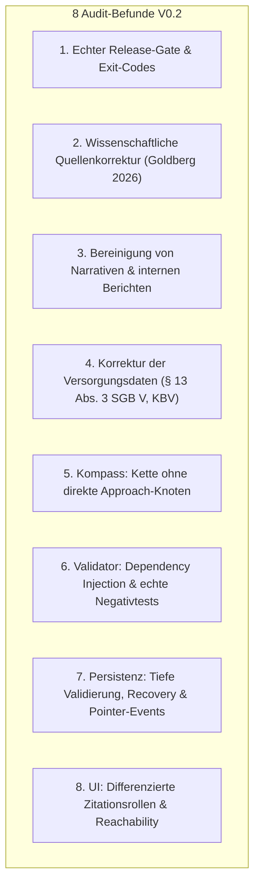

# Korrekturplan: V0.2 Audit & Release-Härtung

> **Dokument:** `docs/CORRECTION_PLAN_V02_AUDIT.md`  
> **Projekt:** Landkarte der Psychotherapie  
> **Basis-Commit:** `8006cc43892208238eaae461715e7a9f1bba417b`  
> **Status:** Verbindlicher Korrekturplan zur Prüfung (Stopppunkt vor Implementierung)  
> **Regel:** In dieser Phase werden **keine Programmdateien verändert**.

---

## Übersicht der 8 Audit-Schwerpunkte



---

## 1. Echter Release-Gate

### 1.1 Betroffene Dateien
* `package.json`
* `scripts/validateRelease.js` (Neu)
* `src/validation/validateKnowledge.ts`

### 1.2 Geplante Datenmodell- oder API-Änderung
* Trennung von technischer Build-Validierung und formalem Release-Gate in `package.json`:
  ```json
  "scripts": {
    "dev": "vite",
    "test": "vitest run",
    "test:knowledge": "vitest run tests/knowledgeValidation.test.ts",
    "build:technical": "tsc && vite build",
    "validate:release": "node scripts/validateRelease.js",
    "build": "tsc && vitest run && node scripts/validateRelease.js && vite build"
  }
  ```
* **Reachability Traversal Definition:**  
  Ein Claim gilt als *erreichbar*, wenn er über mindestens eine der folgenden Wurzeln im Graph referenziert wird:
  1. `Scene.hotspots[].dialogue.claimIds` & `subtextClaimIds`
  2. `HotspotAction.claimIds`, `QuizPayload.explanationClaimIds`, `ItemPayload.claimIds`
  3. `ExplorationRoute.disclaimerClaimIds`, `RouteOption.perspectiveClaimIds`
  4. `LocationNode.teaserClaimIds`, `LocationNode.knowledgeNodeIds -> KnowledgeNode.claimIds`
* `scripts/validateRelease.js` führt den Reachability-Check aus. Werden erreichbare Claims mit `reviewStatus === 'draft'` oder Validierungsfehler gefunden, bricht das Skript mit `process.exit(1)` ab.

### 1.3 Migration & Rückwärtskompatibilität
* Vollständig kompatibel. `npm run build:technical` erlaubt weiterhin Entwicklungs- und Test-Builds, während `npm run build` als strikter Release-Gate fungiert.

### 1.4 Konkrete automatisierte Akzeptanztests
* `tests/knowledgeValidation.test.ts`: Testfall prüft, dass der Report `releaseStatus === 'BLOCKED_BY_DRAFT_CONTENT'` ausgibt, solange mindestens ein erreichbarer Claim den Status `draft` hat.
* Eigener Test für die Reachability-Funktion: Unreferenzierte Claims blockieren nicht, erreichbare Claims blockieren.

### 1.5 Erwartete Kommando-Ausgaben und Exit-Codes
* `npm test`: **Exit 0** (Alle Tests grün).
* `npx tsc --noEmit`: **Exit 0** (Keine Typfehler).
* `npm run build:technical`: **Exit 0** (Vite-Bundle erfolgreich generiert).
* `npm run build`: **Exit 1** (`[RELEASE GATE FAILED] 7 erreichbare Claims im Status 'draft'. Release blockiert: BLOCKED_BY_DRAFT_CONTENT`).

### 1.6 Risiken und bewusst nicht bearbeitete Punkte
* *Risiko:* Automatisierte CI-Pipelines könnten fehlschlagen, wenn sie `npm run build` statt `npm run build:technical` aufrufen.  
  *Entscheidung:* Dies ist gewollt, um eine unautorisierte Veröffentlichung von Entwürfen zu verhindern.

---

## 2. Wissenschaftliche Quellenkorrektur

### 2.1 Betroffene Dateien
* `src/data/knowledge/sources.ts`
* `src/data/knowledge/claims.ts`
* `src/data/knowledge/nodes.ts`
* `src/data/knowledge/relations.ts`

### 2.2 Geplante Datenmodell- oder API-Änderung
* **Korrektur des Goldberg-2026-Eintrags in `sources.ts`:**
  * `id`: `'src_goldberg_2026_therapist_characteristics'`
  * `title`: *„Multimodal Assessments of Therapist Characteristics Are Largely Unrelated to Patient Outcomes: A Preregistered Analysis“*
  * `authors`: *„Goldberg, S. B., et al.“*
  * `year`: `2026`
  * `venue`: *„Clinical Psychological Science“*
  * `doi`: `'10.1177/21677026261424222'`
  * `peerReviewed`: `true`
* **Neuer eng begrenzter Claim in `claims.ts`:**
  * `id`: `'claim_therapist_characteristics_null_finding'`
  * `type`: `'association'`
  * `statement`: *„Statische Vorab-Erhebungen von Therapeutenmerkmalen (z. B. Persönlichkeit, interpersonelle Fertigkeiten) zeigen weitgehend keine statistische Vorhersagekraft für den tatsächlichen Behandlungserfolg.“*
  * `publicExplanation`: *„Eine präregistrierte Studie (Goldberg et al., 2026) untersuchte multimodale Therapeutenmerkmale und fand nahezu keine Vorhersagekraft für das Therapieergebnis. Statische Merkmale eignen sich daher nicht für automatisierte Zuweisungen.“*
  * `evidenceLevel`: `'well-supported'`
  * `reviewStatus`: `'draft'`
  * `citations`: `[{ sourceId: 'src_goldberg_2026_therapist_characteristics', role: 'supports', locator: 'Ergebnisse & Diskussion', note: 'Präregistrierte Nullbefunde zu statischen Merkmalen' }]`
* **Korrektur von `claim_fit_collaboration_dynamic`:**
  * Goldberg wird als `role: 'qualifies'` (nicht `supports`) eingebunden, da die Studie zeigt, was *nicht* vorhersagbar ist, ohne selbst Kausalitätsnachweise für dynamische Prozesse zu führen.
* **Korrektur von `claim_evidence_perspectives`:**
  * `type: 'definition'`, `evidenceLevel: 'not-applicable'`. Definitionsmodelle dürfen nicht als empirisch „well-supported“ gelabelt werden.

### 2.3 Migration & Rückwärtskompatibilität
* Reine Datenkorrektur; keine Breaking Changes an Schnittstellen.

### 2.4 Konkrete automatisierte Akzeptanztests
* Test prüft, dass `src_goldberg_2026_therapist_characteristics` den exakten Titel, DOI und Journalnamen trägt.
* Test prüft, dass kein Claim vom Typ `definition` oder `theory` ohne direkte empirische Zitation `evidenceLevel: 'well-supported'` trägt.
* Test prüft, dass kein Claim ohne verifizierten Locator und Originalquelle auf `source-checked` gesetzt ist.

### 2.5 Erwartete Kommando-Ausgaben und Exit-Codes
* `npm test`: **Exit 0**.

### 2.6 Risiken und bewusst nicht bearbeitete Punkte
* Alle Claims verbleiben im Status `draft`, bis die Zitatstellen formal abgenommen sind.

---

## 3. Bereinigung von Narrativen und internen Berichten

### 3.1 Betroffene Dateien
* `src/types/content.ts`
* `src/data/knowledge/sources.ts`
* `src/data/knowledge/claims.ts`
* `src/validation/validateKnowledge.ts`

### 3.2 Geplante Datenmodell- oder API-Änderung
* **Erweiterung von `SourceRecord` in `src/types/content.ts`:**
  ```typescript
  export type NarrativeValence = 'positive' | 'negative' | 'mixed';

  export interface SourceRecord {
    // ...
    valence?: NarrativeValence; // Verpflichtend bei kind === 'patient-narrative'
    provenance?: string;        // Herkunft / Erhebungskontext
  }
  ```
* **Entfernung von `src_narrative_rumination_action_2025`:**
  * Vollständige Löschung aus `sources.ts`.
  * `claim_action_oriented_rumination` wird ausschließlich auf `src_grawe_1997` (Problembewältigung & Klärung) gestützt.
* **Validierungsregel:** Narrative dürfen niemals mit `role: 'supports'` an Claims mit `evidenceLevel: 'well-supported'` oder `type: 'effectiveness'` hängen.

### 3.3 Migration & Rückwärtskompatibilität
* Rückwärtskompatibel.

### 3.4 Konkrete automatisierte Akzeptanztests
* Negativ-Test: Versuch, eine narrative Quelle ohne `narrativeForm` oder `valence` anzulegen, wirft `ERROR`.
* Negativ-Test: Versuch, ein Narrativ als `supports` für einen Wirksamkeitsclaim zu verwenden, wirft `ERROR`.

### 3.5 Erwartete Kommando-Ausgaben und Exit-Codes
* `npm test`: **Exit 0**.

### 3.6 Risiken und bewusst nicht bearbeitete Punkte
* In V0.2 werden vorerst keine unzureichend belegten Patientenzitate öffentlich angezeigt, bis Primärerhebungen vorliegen.

---

## 4. Korrektur der Versorgungsdaten

### 4.1 Betroffene Dateien
* `src/data/knowledge/sources.ts`
* `src/data/knowledge/claims.ts`
* `src/validation/validateKnowledge.ts`

### 4.2 Geplante Datenmodell- oder API-Änderung
* **KBV-Quelle (`src_kbv_terminservicestelle_2024`):**
  * `url`: `'https://www.kbv.de/html/themen_1120.php'`
  * `jurisdiction`: `'DE'`
  * `lastCheckedAt`: `'2026-03-01'`
* **G-BA-Quelle (`src_gba_psychotherapie_richtlinie`):**
  * `venue`: `'Bundesanzeiger BAnz AT 05.04.2023 B2 i.d.F. v. 15.12.2023'`
  * `url`: `'https://www.g-ba.de/richtlinien/20/'`
  * `validFrom`: `'2017-04-01'`
* **Überarbeitung von `claim_care_funding_paths` (§ 13 Abs. 3 SGB V):**
  * Gesetzliche Kriterien: Unaufschiebbarkeit / Systemversagen der Kasse, Nachweispflicht erfolgloser Kassenplatzsuche, vorherige schriftliche Antragstellung und Ablehnung.
* **Validierungsregel:** Jede Quelle mit `kind: 'official'` muss `jurisdiction`, `url` und `lastCheckedAt` besitzen.

### 4.3 Migration & Rückwärtskompatibilität
* Reine Inhalts- und Metadatenkorrektur.

### 4.4 Konkrete automatisierte Akzeptanztests
* Test validiert, dass alle offiziellen Quellen die Pflichtfelder `jurisdiction`, `url` und `lastCheckedAt` im korrekten Format (ISO 8601) enthalten.

### 4.5 Erwartete Kommando-Ausgaben und Exit-Codes
* `npm test`: **Exit 0**.

### 4.6 Risiken und bewusst nicht bearbeitete Punkte
* Regionale Sondervereinbarungen einzelner KVen werden nicht als Bundesrecht dargestellt.

---

## 5. Kompass und Wissensgraph: Kette ohne direkte Approach-Knoten

### 5.1 Betroffene Dateien
* `src/data/knowledge/nodes.ts`
* `src/data/knowledge/relations.ts`
* `src/data/exploration/routes.ts`
* `src/validation/validateKnowledge.ts`

### 5.2 Geplante Datenmodell- oder API-Änderung
* **Ergänzung von Bedürfnis- und Prozessknoten in `nodes.ts`:**
  * `node_need_orientation_clarity` (`kind: 'need'`)
  * `node_proc_problem_solving` (`kind: 'process'`)
  * `node_proc_emotional_clarification` (`kind: 'process'`)
* **Korrektur in `src/data/exploration/routes.ts`:**
  * `RouteOption.targetKnowledgeNodeIds` verweist **ausschließlich** auf Knoten der Typen `'need'` oder `'working-mode'`.
  * Direkte Verweise auf `node_app_psychodynamic`, `node_app_systemic`, `node_app_cbt`, `node_app_humanistic` werden aus den 5 Routenoptionen entfernt!
* **Bereinigung der unvollständigen `bookmarkId`s:**
  * Optionen 2 bis 5 erhalten `bookmarkId: undefined`.
  * Nur Option 1 behält `bookmarkId: 'bm_initial_interview_question_action'`, die in der Zielszene `scene_workshop` explizit gespeichert werden kann.

### 5.3 Migration & Rückwärtskompatibilität
* Bestehende Spielstände bleiben intakt.

### 5.4 Konkrete automatisierte Akzeptanztests
* Test validiert, dass keine `RouteOption.targetKnowledgeNodeIds` Knoten vom Typ `approach` enthält.
* Test prüft, dass genau 5 Routenoptionen existieren.
* Test prüft, dass nur Option 1 eine funktionale `bookmarkId` besitzt.

### 5.5 Erwartete Kommando-Ausgaben und Exit-Codes
* `npm test`: **Exit 0**.

### 5.6 Risiken und bewusst nicht bearbeitete Punkte
* Die Teaser-Optionen 2 bis 5 verbleiben als hochwertige Vorschauen ohne eigene Zielszene.

---

## 6. Validator und Test-Architektur (Dependency Injection)

### 6.1 Betroffene Dateien
* `src/validation/validateKnowledge.ts`
* `tests/knowledgeValidation.test.ts`

### 6.2 Geplante Datenmodell- oder API-Änderung
* `validateKnowledgeGraph(customData?: KnowledgeDatasets)` akzeptiert injizierbare Teildatensätze für isolierte Negativtests.
* Implementierung von Prüfungen für:
  1. Doppelte IDs
  2. Tote Referenzen
  3. Unzulässige Knotentypen in Routen
  4. Unzulässige Zitationsrollen bei Narrativen
  5. Fehlende Locator bei offiziellen Quellen
  6. Nichterreichbare Zielorte

### 6.3 Migration & Rückwärtskompatibilität
* Rückwärtskompatibel (Default-Parameter nutzen die echten Datensätze).

### 6.4 Konkrete automatisierte Akzeptanztests
* 8 isolierte Negativtests mit gemockten Datensätzen.
* Positivtest der echten Produktionsdatenbank.

### 6.5 Erwartete Kommando-Ausgaben und Exit-Codes
* `npm test`: **Exit 0**.

### 6.6 Risiken und bewusst nicht bearbeitete Punkte
* Keine.

---

## 7. Persistenz, Recovery und Pointer-Events

### 7.1 Betroffene Dateien
* `src/types/state.ts`
* `src/state/storage.ts`
* `src/engine/LandmarkSprite.ts`
* `src/engine/MapEngine.ts`
* `tests/storage.test.ts`
* `tests/mapEngine.test.ts` (Neu)

### 7.2 Geplante Datenmodell- oder API-Änderung
* **Tiefe Validierung aller Felder in `storage.ts`:**
  * Jedes Element in `artifacts`, `interests`, `aboutMeMarks`, `bookmarks` und `quizAnswers` wird strukturell validiert.
* **Recovery-Verhalten:**
  * Beschädigte Daten werden unter `psychotherapie_landkarte_corrupted_recovery_<timestamp>` gesichert.
* **Bereinigung von `LandmarkSprite.ts`:**
  * Entfernen von `this.on('pointertap', ...)` zur Vermeidung von Doppel-Events auf Touchscreens. Interaktion erfolgt ausschließlich über drag-tolerantes `pointerup`.
* **MapEngine Zoom & Bounds:**
  * Unit-Tests für `fitLocations()`, Bounding-Box-Kalkulation und Clamping.

### 7.3 Migration & Rückwärtskompatibilität
* 100 % abwärtskompatibel mit `schemaVersion: 1`.

### 7.4 Konkrete automatisierte Akzeptanztests
* `tests/storage.test.ts`:
  * Test importiert defekte Bookmarks/Interests -> liefert `CORRUPTED_DATA`, Zustand bleibt unverändert.
  * Test schreibt korrupten LocalStorage-Key -> Recovery-Key wird mit Originalinhalt angelegt.
* `tests/mapEngine.test.ts`:
  * Test prüft `fitLocations` mit 0, 1 und mehreren Koordinaten.

### 7.5 Erwartete Kommando-Ausgaben und Exit-Codes
* `npm test`: **Exit 0**.

### 7.6 Risiken und bewusst nicht bearbeitete Punkte
* Keine.

---

## 8. Darstellung der Evidenz & Zitationsrollen im UI

### 8.1 Betroffene Dateien
* `src/ui/ActionModal.ts`
* `src/styles/dialogue.css`

### 8.2 Geplante Datenmodell- oder API-Änderung
* **Farbkodierte Badges für alle 4 Zitationsrollen:**
  * `supports`: 🟢 *Stützt Befund*
  * `qualifies`: 🟡 *Schränkt ein / Qualifiziert*
  * `contradicts`: 🔴 *Widerspricht Befund*
  * `background`: 🔵 *Theoretischer / Narrativer Kontext*
* **Reachability der Quellenanzeige:**
  * Einbindung von Quellen-Akkordeons in Routen-Disclaimer, Perspektivbeschreibungen und Teaser-Cards.

### 8.3 Migration & Rückwärtskompatibilität
* Reine UI-Verbesserung.

### 8.4 Konkrete automatisierte Akzeptanztests
* Snapshot/DOM-Tests prüfen die korrekten CSS-Klassen für Zitationsrollen.

### 8.5 Erwartete Kommando-Ausgaben und Exit-Codes
* `npm test`: **Exit 0**.

### 8.6 Risiken und bewusst nicht bearbeitete Punkte
* Keine.

---

## 9. Zusammenfassung der erwarteten Testergebnisse & Exit-Codes

| Befehl | Erwartetes Ergebnis | Exit-Code | Begründung |
|---|---|:---:|---|
| `npm test` | **Alle Tests erfolgreich** | **0** | Alle Logik- und Negativtests bestehen. |
| `npx tsc --noEmit` | **0 Typfehler** | **0** | Vollständige statische Typsicherheit. |
| `npm run build:technical` | **Bundle gebaut** | **0** | Technischer Build läuft sauber durch. |
| `npm run build` | **Release blockiert** | **1** | Release-Gate meldet `BLOCKED_BY_DRAFT_CONTENT`. |

---

## Stopppunkt

Der Korrekturplan liegt vollständig unter `docs/CORRECTION_PLAN_V02_AUDIT.md` vor.  
Es wurden **keine Programmdateien verändert**. Ich warte auf deine Freigabe.
