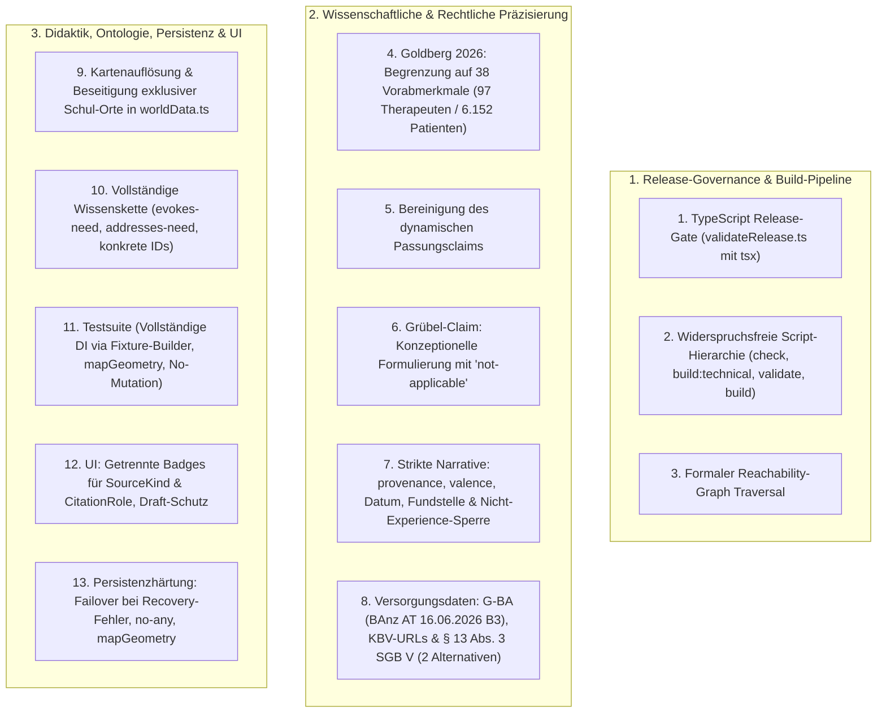

# Korrekturplan V2.1: Audit-Behebung & Strikte Release-Härtung

> **Dokumentenversion:** 2.1  
> **Projekt:** Landkarte der Psychotherapie  
> **Basis-Commit (V0.2 Release):** `8006cc43892208238eaae461715e7a9f1bba417b`  
> **Plan-Vorgänger-Commit (V2.0):** `ce8599c`  
> **Status:** Verbindlicher Korrekturplan zur formalen Freigabe (Stopppunkt vor Implementierung)  
> **Regel:** In dieser Phase werden **keine Programmdateien verändert**.

---

## Übersicht der 13 Korrekturbereiche



---

## 1. Echter Release-Gate mit TypeScript (`validateRelease.ts` via `tsx`)

### 1.1 Betroffene Dateien
* `package.json`
* `package-lock.json`
* `scripts/validateRelease.ts` (Neu)
* `src/validation/validateKnowledge.ts`

### 1.2 Geplante Datenmodell- & Skript-Architektur
* Aufnahme von `tsx` in `devDependencies` in `package.json`.
* Implementierung von `scripts/validateRelease.ts` in nativer TypeScript-Syntax (kein Umweg über ungetypte `.js`-Dateien).
* **Widerspruchsfreie Script-Hierarchie in `package.json`:**
  ```json
  "scripts": {
    "dev": "vite",
    "check:technical": "tsc --noEmit && vitest run",
    "test": "vitest run",
    "test:knowledge": "vitest run tests/knowledgeValidation.test.ts",
    "build:technical": "tsc && vite build",
    "validate:release": "tsx scripts/validateRelease.ts",
    "build": "tsc && vitest run && tsx scripts/validateRelease.ts && vite build"
  }
  ```
* **Ausführungsreihenfolge in `npm run build`:**
  1. `tsc` (Vollständige Typprüfung)
  2. `vitest run` (Unit-, Geometrie- & Validierungstests)
  3. `tsx scripts/validateRelease.ts` (Release-Gate)
  4. `vite build` (Bundle-Erzeugung **nur** bei Erfolg der Schritte 1–3)

### 1.3 Reachability Traversal Definition
Ein Claim gilt als **erreichbar**, wenn er über mindestens einen der folgenden 6 Pfade referenziert wird:
1. **Route-Trigger:** `ExplorationRoute.triggerNodeId -> KnowledgeNode.claimIds`
2. **Routenzielknoten:** `RouteOption.targetKnowledgeNodeIds -> KnowledgeNode.claimIds`
3. **Erreichbare Relationen:** `KnowledgeRelation.claimIds` (für alle Relationen zwischen erreichbaren Knoten)
4. **Szenen-Dialoge & Subtexte:** `Scene.hotspots[].dialogue.claimIds` & `subtextClaimIds`
5. **Verschachtelte Aktionen:** `HotspotAction.claimIds`, `QuizPayload.explanationClaimIds`, `ItemPayload.claimIds`
6. **Geografie & Didaktik:** `LocationNode.teaserClaimIds`, `LocationNode.knowledgeNodeIds -> KnowledgeNode.claimIds`, `ExplorationRoute.disclaimerClaimIds`, `RouteOption.perspectiveClaimIds`

*Verhalten des Release-Gates:*
Findet `validateRelease.ts` erreichbare Claims mit `reviewStatus === 'draft'` oder strukturelle Validierungsfehler, bricht das Skript mit `process.exit(1)` ab.

### 1.4 Migration & Rückwärtskompatibilität
* `build:technical` erlaubt weiterhin Entwicklungs- und Preview-Builds. `build` blockiert Releases verlässlich bei unfertigen Entwürfen.

### 1.5 Konkrete automatisierte Akzeptanztests
* `tests/knowledgeValidation.test.ts`: Test prüft, dass der Report `releaseStatus === 'BLOCKED_BY_DRAFT_CONTENT'` zurückgibt, solange erreichbare Drafts existieren.
* Test prüft, dass unreferenzierte Draft-Claims das Release nicht blockieren.

### 1.6 Erwartete Kommando-Ausgaben und Exit-Codes
* `npm test`: **Exit 0**
* `npm run check:technical`: **Exit 0**
* `npm run build:technical`: **Exit 0**
* `npm run build`: **Exit 1** (`[RELEASE GATE FAILED] 7 erreichbare Claims im Status 'draft'. Release blockiert: BLOCKED_BY_DRAFT_CONTENT`)

### 1.7 Risiken & bewusst nicht bearbeitete Punkte
* *Reales Risiko:* Fehlende Internetverbindung bei CI-Läufen, falls `tsx` nicht lokal in `node_modules` vorhanden ist.  
  *Gegenmaßnahme:* `tsx` wird explizit als feste `devDependency` in `package.json` hinterlegt und über `package-lock.json` gepinnt.

---

## 2. Wissenschaftliche Quellenkorrektur (Goldberg et al., 2026)

### 2.1 Betroffene Dateien
* `src/data/knowledge/sources.ts`
* `src/data/knowledge/claims.ts`
* `src/data/knowledge/nodes.ts`
* `src/data/knowledge/relations.ts`

### 2.2 Geplante Datenmodell- & API-Änderungen
* **Exakter Datensatz in `sources.ts`:**
  ```typescript
  {
    id: 'src_goldberg_2026_therapist_characteristics',
    kind: 'primary-study',
    title: 'Multimodal Assessments of Therapist Characteristics Are Largely Unrelated to Patient Outcomes: A Preregistered Analysis',
    authors: 'Goldberg, S. B., et al.',
    year: 2026,
    venue: 'Clinical Psychological Science',
    doi: '10.1177/21677026261424222',
    peerReviewed: true
  }
  ```
* **Eng begrenzter Claim in `claims.ts` (ohne pauschale Verallgemeinerung):**
  ```typescript
  {
    id: 'claim_therapist_characteristics_null_finding',
    type: 'association',
    statement: 'Die 38 in dieser Untersuchung erhobenen Vorabmerkmale von Therapeutinnen und Therapeuten zeigten weitgehend keine statistische Vorhersagekraft für die Behandlungsergebnisse der untersuchten Patientinnen und Patienten.',
    publicExplanation: 'In einer großangelegten, präregistrierten Analyse mit 97 Therapeutinnen/Therapeuten und 6.152 Patientinnen/Patienten sagten die 38 multimodalen Vorab-Merkmale (Persönlichkeit, Bindungsstil, soziale Fertigkeiten) das Therapieergebnis kaum vorher (Goldberg et al., 2026, S. 1–18, Tabellen 2 & 3).',
    citations: [
      {
        sourceId: 'src_goldberg_2026_therapist_characteristics',
        role: 'supports',
        locator: 'S. 1–18, insb. Tabellen 2 & 3',
        note: 'Präregistrierte Nullbefunde zu 38 spezifischen Therapeutenmerkmalen'
      }
    ],
    evidenceLevel: 'limited',
    reviewStatus: 'draft',
    limitations: 'Untersuchte ausschließlich die 38 statischen Merkmale vor Therapiebeginn; keine Aussage über dynamische Prozessmerkmale oder andere Matching-Konzepte (z. B. Präferenz- oder Problem-Matching).'
  }
  ```
* **Korrektur von `claim_fit_collaboration_dynamic`:**
  * Goldberg 2026 wird **vollständig entfernt**, da die Studie keine direkte empirische Kausalitäts- oder Stützungsbeziehung für dynamische Passung liefert. Der Claim verbleibt als rein konzeptioneller Prozessclaim (`evidenceLevel: 'not-applicable'`, gestützt auf Standardmodelle der therapeutischen Allianz).
* **Korrektur von `claim_evidence_perspectives`:**
  * Definitions- und Konzeptclaims erhalten `evidenceLevel: 'not-applicable'`, da epistemische Rahmenmodelle keine empirischen Wirksamkeitsnachweise darstellen.

### 2.3 Migration & Rückwärtskompatibilität
* Konsistente Anpassung des Datenmodells ohne Bruch.

### 2.4 Konkrete automatisierte Akzeptanztests
* Test validiert Titel, DOI, Autoren und Journal von `src_goldberg_2026_therapist_characteristics`.
* Test prüft, dass `claim_fit_collaboration_dynamic` Goldberg 2026 nicht mehr referenziert.
* Test stellt sicher, dass Claims vom Typ `definition` oder `theory` nicht als `well-supported` gelabelt sind.

### 2.5 Erwartete Kommando-Ausgaben
* `npm test`: **Exit 0**.

### 2.6 Risiken & bewusst nicht bearbeitete Punkte
* *Reales Risiko:* Nutzer könnten den Nullbefund als generelle Nutzlosigkeit von Therapeutenqualifikationen missverstehen.  
  *Gegenmaßnahme:* Das Feld `limitations` stellt klar, dass es sich um Vorab-Profileigenschaften handelt und die Qualität der gemeinsamen Arbeitsbeziehung unberührt bleibt.

---

## 3. Bereinigung von Narrativen und konzeptioneller Grübel-Claim

### 3.1 Betroffene Dateien
* `src/types/content.ts`
* `src/data/knowledge/sources.ts`
* `src/data/knowledge/claims.ts`
* `src/validation/validateKnowledge.ts`

### 3.2 Geplante Datenmodell- & API-Änderungen
* **Erweiterung von `SourceRecord` in `src/types/content.ts`:**
  ```typescript
  export type NarrativeValence = 'positive' | 'negative' | 'mixed';

  export interface SourceRecord {
    // ...
    valence?: NarrativeValence; // Verpflichtend bei kind === 'patient-narrative'
    provenance?: string;        // Verpflichtende Herkunft/Erhebungskontext
    publishedDate?: string;     // ISO 8601 Datum
    locatorOrUrl?: string;      // Verpflichtende Fundstelle oder URL
  }
  ```
* **Vollständige Löschung:**
  * `src_narrative_rumination_action_2025` wird restlos aus `sources.ts` und `claims.ts` entfernt.
* **Neufassung von `claim_action_oriented_rumination` als rein konzeptioneller Claim:**
  ```typescript
  {
    id: 'claim_action_oriented_rumination',
    type: 'theory',
    statement: 'In verschiedenen theoretischen Prozessmodellen wird handlungsorientiertes Ausprobieren als Ansatzpunkt zur Unterbrechung von repetitivem Grübeln beschrieben.',
    publicExplanation: 'Klaus Grawe (1997, S. 420–445) beschreibt Problembewältigung und konkrete Handlungsaktivierung als zentrale Wirkperspektiven, um passive Gedankenschleifen durch neue Erfahrungen im Handeln zu unterbrechen.',
    citations: [
      {
        sourceId: 'src_grawe_1997',
        role: 'background',
        locator: 'Kapitel Problembewältigung, S. 420–445'
      }
    ],
    evidenceLevel: 'not-applicable', // Rein konzeptionelles Modell, kein RCT-Wirksamkeitsversprechen
    reviewStatus: 'draft'
  }
  ```
* **Strikte Validierungsregel für Narrative:**
  * Jede Zitation mit `role: 'supports'` an einem Claim mit `type !== 'experience'` wird vom Validator als fataler Fehler abgelehnt.

### 3.3 Migration & Rückwärtskompatibilität
* Rückwärtskompatibel.

### 3.4 Konkrete automatisierte Akzeptanztests
* Test wirft `ERROR`, wenn eine narrative Quelle ohne `valence`, `narrativeForm`, `provenance`, `publishedDate` oder `locatorOrUrl` existiert.
* Test wirft `ERROR`, wenn ein Narrativ als `supports` an einem Claim vom Typ `effectiveness`, `process`, `association`, `definition`, `care-fact` oder `theory` hängt.

### 3.5 Erwartete Kommando-Ausgaben
* `npm test`: **Exit 0**.

### 3.6 Risiken & bewusst nicht bearbeitete Punkte
* *Reales Risiko:* Fehlende persönliche Erfahrungsberichte in V0.2.  
  *Entscheidung:* Vorübergehender Verzicht ist fachlich und ethisch vorzuziehen gegenüber ungesicherten Pseudonarrativen.

---

## 4. Korrektur der Versorgungsdaten (G-BA, KBV & § 13 Abs. 3 SGB V)

### 4.1 Betroffene Dateien
* `src/data/knowledge/sources.ts`
* `src/data/knowledge/claims.ts`
* `src/validation/validateKnowledge.ts`

### 4.2 Geplante Datenmodell- & API-Änderungen
* **G-BA Quelle (`src_gba_psychotherapie_richtlinie`):**
  * `venue`: `'Bundesanzeiger BAnz AT 16.06.2026 B3, Beschluss vom 19.03.2026, in Kraft getreten am 17.06.2026'`
  * `url`: `'https://www.g-ba.de/richtlinien/20/'`
  * `validFrom`: `'2017-04-01'`
  * `lastCheckedAt`: `'2026-09-03'` // Tatsächliches Prüfdatum
  * `jurisdiction`: `'DE'`
* **KBV Quellen (`sources.ts`):**
  * `src_kbv_psychotherapie`:
    * `title`: *„Kassenärztliche Bundesvereinigung: Psychotherapeutische Versorgung“*
    * `url`: `'https://www.kbv.de/psychotherapie'`
    * `jurisdiction`: `'DE'`, `lastCheckedAt`: `'2026-09-03'`
  * `src_kbv_terminvermittlung`:
    * `title`: *„Kassenärztliche Bundesvereinigung: Terminvermittlung über 116 117“*
    * `url`: `'https://www.kbv.de/praxis/praxisfuehrung/terminvermittlung'`
    * `jurisdiction`: `'DE'`, `lastCheckedAt`: `'2026-09-03'`
* **Wörtlich und rechtlich präzise Neufassung von `claim_care_funding_paths` (§ 13 Abs. 3 SGB V):**
  ```typescript
  {
    id: 'claim_care_funding_paths',
    type: 'care-fact',
    statement: 'Gesetzlich Versicherte haben nach § 13 Abs. 3 Satz 1 SGB V Anspruch auf Erstattung tatsächlich entstandener Kosten für eine selbstbeschaffte notwendige Leistung.',
    publicExplanation: 'Das Gesetz sieht zwei getrennte Alternativen vor: (1) Die Krankenkasse konnte eine unaufschiebbare Leistung nicht rechtzeitig erbringen, oder (2) eine Leistung wurde zu Unrecht abgelehnt. Die Kostenerstattung umfasst die tatsächlich entstandenen Kosten der notwendigen Leistung; bei psychotherapeutischen Leistungen müssen die behandelnden Personen die Voraussetzungen des § 95c SGB V (Approbation, Fachkunde) erfüllen.',
    citations: [
      {
        sourceId: 'src_sgb5_paragraph13',
        role: 'supports',
        locator: '§ 13 Abs. 3 Satz 1 SGB V i.V.m. § 95c SGB V'
      }
    ],
    evidenceLevel: 'not-applicable',
    reviewStatus: 'draft',
    limitations: 'Vorherige Antragstellung und schriftlicher Ablehnungsbescheid sind Voraussetzung bei Alternative 2; bei akuten unaufschiebbaren Notfällen (Alternative 1) greift der Grundsatz der Systemversagens-Kostenerstattung ohne vorherige Wartepflicht auf einen Ablehnungsbescheid.'
  }
  ```

### 4.3 Migration & Rückwärtskompatibilität
* Reine Inhalts- und Metadatenkorrektur.

### 4.4 Konkrete automatisierte Akzeptanztests
* Test prüft, dass alle Quellen mit `kind: 'official'` gültige `url`, `jurisdiction: 'DE'` und ein ISO-8601-Datumsformat in `lastCheckedAt` besitzen (keine zukünftigen Daten).
* Test validiert, dass `claim_care_funding_paths` beide Alternativen des § 13 Abs. 3 Satz 1 SGB V korrekt getrennt abbildet und § 95c SGB V nennt.

### 4.5 Erwartete Kommando-Ausgaben
* `npm test`: **Exit 0**.

### 4.6 Risiken & bewusst nicht bearbeitete Punkte
* *Reales Risiko:* Gesetzliche Änderungen des SGB V nach dem Stichtag.  
  *Gegenmaßnahme:* Automatisierter Validator prüft `lastCheckedAt` auf Aktualität.

---

## 5. Kartenauflösung, Wissenskette & Relationen

### 5.1 Betroffene Dateien
* `src/types/content.ts`
* `src/data/worldData.ts`
* `src/data/knowledge/nodes.ts`
* `src/data/knowledge/relations.ts`
* `src/data/exploration/routes.ts`
* `src/validation/validateKnowledge.ts`

### 5.2 Geplante Datenmodell- & API-Änderungen
* **Neue Relationstypen in `src/types/content.ts`:**
  ```typescript
  export type RelationType =
    | 'evokes-need'      // experience -> need
    | 'addresses-need'   // need -> working-mode
    | 'implements'       // process -> intervention
    | 'acts-via'         // working-mode -> process
    | 'belongs-to'       // intervention -> approach
    | 'examines-fit'     // working-mode -> collaboration / collaboration -> alliance
    | 'explores-aspect';
  ```

* **Vollständige Kette (Beispiel Werkstattpfad) mit konkreten IDs und stützenden Claims:**
  1. `node_exp_constant_rumination` (Erleben)
     → `rel_rumination_evokes_coping` (`evokes-need`, Claim: `claim_action_oriented_rumination`)
  2. `node_need_structure_coping` (Bedürfnis: Wunsch nach konkreter Handlungsfähigkeit)
     → `rel_need_addresses_action` (`addresses-need`, Claim: `claim_action_oriented_rumination`)
  3. `node_wm_concrete_action` (Arbeitsweise: Konkrete Strategien & Handlungen)
     → `rel_action_acts_via_activation` (`acts-via`, Claim: `claim_action_oriented_rumination`)
  4. `node_proc_behavioral_activation` (Prozess: Verhaltensaktivierung)
     → `rel_activation_implements_exp` (`implements`, Claim: `claim_action_oriented_rumination`)
  5. `node_tech_behavioral_experiment` (Intervention: Verhaltensexperimente)
     → `rel_exp_to_cbt` (`belongs-to`, Claim: `claim_gba_guidelines`)
  6. `node_app_cbt` (Ansatz: KVT)
     *Zusätzlich:* `node_tech_chair_work` → `rel_chair_to_humanistic` (`belongs-to`, Claim: `claim_gba_guidelines`) → `node_app_humanistic`; `node_tech_systemic_tasks` → `rel_tasks_to_systemic` (`belongs-to`, Claim: `claim_gba_guidelines`) → `node_app_systemic`
  7. `node_wm_concrete_action` → `rel_action_to_fit` (`examines-fit`, Claim: `claim_fit_collaboration_dynamic`)
  8. `node_collab_fit_examination` (Zusammenarbeit: Gemeinsame Passungsprüfung im Erstgespräch)
     → `rel_fit_to_alliance` (`examines-fit`, Claim: `claim_therapeutic_alliance`)
  9. `node_collab_therapeutic_alliance` (Allianz als schulenübergreifender Wirkfaktor)

* **Konkrete Zuordnung von `knowledgeNodeIds` in `worldData.ts` (Beseitigung exklusiver Schul-Orte):**
  * `loc_lighthouse`: `['node_collab_therapeutic_alliance', 'node_exp_constant_rumination', 'node_need_structure_coping', 'node_wm_concrete_action']`
  * `loc_station`: `['node_care_116117_ptv11', 'node_care_funding_paths', 'node_need_orientation_clarity']`
  * `loc_workshop`: `['node_wm_concrete_action', 'node_proc_behavioral_activation', 'node_tech_behavioral_experiment', 'node_tech_chair_work', 'node_tech_systemic_tasks', 'node_collab_fit_examination']`
  * `loc_teaser_psychoanalysis`: `['node_app_psychodynamic', 'node_proc_schema_exploration']`
  * `loc_teaser_systemic`: `['node_app_systemic', 'node_tech_systemic_tasks']`
  * `loc_teaser_mindfulness`: `['node_proc_defusion']`
  * `loc_teaser_body`: `['node_wm_body_emotion']`

* **Verhalten beim Anklicken der Optionen 2–5:**
  * `bookmarkId` wird bei Optionen 2–5 **vollständig aus dem Datenobjekt gelöscht** (nicht als `undefined` deklariert; Interface `bookmarkId?: string` ist optional).
  * Klick auf Optionen 2–5 hebt keine isolierten Schul-Orte hervor, sondern öffnet ein dezent gestaltetes Informationsbanner:
    *„🧭 Erkundungsperspektive: [Label] – Schauplätze in Entwicklung. Entdecke vorerst die Werkstatt der Erprobung für handlungsorientierte Schritte.“*

### 5.3 Migration & Rückwärtskompatibilität
* Rückwärtskompatibel mit bestehendem Graphmodell.

### 5.4 Konkrete automatisierte Akzeptanztests
* Test prüft, dass `RouteOption.targetKnowledgeNodeIds` **ausschließlich** Knoten der Typen `need` oder `working-mode` enthält.
* Test prüft, dass Optionen 2–5 kein `bookmarkId`-Feld besitzen.
* Test traversiert den vollständigen Werkstattpfad von `node_exp_constant_rumination` bis `node_collab_therapeutic_alliance`.

### 5.5 Erwartete Kommando-Ausgaben
* `npm test`: **Exit 0**.

### 5.6 Risiken & bewusst nicht bearbeitete Punkte
* *Reales Risiko:* Nutzer erwarten bei Klick auf Option 2–5 sofort begehbare Szenen.  
  *Gegenmaßnahme:* Klares UI-Banner erläutert transparent den Prototyp-Status der Optionen 2–5.

---

## 6. Validator, Fixture-Builder & erweiterte Testsuite

### 6.1 Betroffene Dateien
* `src/validation/validateKnowledge.ts`
* `tests/fixtures/knowledgeFixtures.ts` (Neu)
* `tests/knowledgeValidation.test.ts`
* `tests/mapGeometry.test.ts` (Neu)

### 6.2 Geplante Datenmodell- & API-Änderungen
* **Strikter Fixture-Builder (`tests/fixtures/knowledgeFixtures.ts`):**
  * `KnowledgeDatasets` muss bei Tests vollständig injiziert werden. Teil-Fixtures werden über `createTestKnowledgeFixture(overrides)` erzeugt (kein stillschweigendes Durchgreifen auf Produktionsdaten).
* **Erweiterte Validierungsregeln & Negativtests:**
  1. `test('rejects duplicate IDs across sources, claims, nodes, routes')`
  2. `test('rejects invalid or future lastCheckedAt dates')`
  3. `test('rejects official sources without jurisdiction or url')`
  4. `test('rejects narrative used as supports on non-experience claims')`
  5. `test('rejects narrative missing provenance, valence, publishedDate or locatorOrUrl')`
  6. `test('rejects route options pointing directly to approach nodes')`
  7. `test('rejects routes with non-experience triggerNodeId')`
  8. `test('ensures exactly 5 unique route options exist')`
  9. `test('ensures LocationNode.sceneId references an existing registered scene')`
  10. `test('ensures each playable Scene matches its LocationNode definition')`
  11. `test('ensures full traversability of the workshop path across all relation stages')`
  12. `test('ensures options 2-5 have no bookmarkId property')`
  13. `test('ensures route selection does not mutate UserState')`

### 6.3 Migration & Rückwärtskompatibilität
* Vollständig kompatibel.

### 6.4 Konkrete automatisierte Akzeptanztests
* Alle 13 Validierungs- und Negativtests laufen isoliert in Vitest.

### 6.5 Erwartete Kommando-Ausgaben
* `npm test`: **Exit 0**.

### 6.6 Risiken & bewusst nicht bearbeitete Punkte
* Keine.

---

## 7. Persistenzhärtung, Recovery-Failover & Geometrie-Extraktion

### 7.1 Betroffene Dateien
* `src/types/state.ts`
* `src/state/storage.ts`
* `src/engine/mapGeometry.ts` (Neu)
* `src/engine/LandmarkSprite.ts`
* `src/engine/MapEngine.ts`
* `src/ui/SceneView.ts`
* `src/main.ts`
* `tests/storage.test.ts`
* `tests/mapGeometry.test.ts` (Neu)

### 7.2 Geplante Datenmodell- & API-Änderungen
* **Vollständige Beseitigung von `state: any` in `SceneView.ts` und `main.ts`.**
* **Strikte Trennung der Speicherzustände in `storage.ts`:**
  * *Gültiges V1:* `schemaVersion === 1` und alle Arrays/Objekte strukturell intakt.
  * *Migrierbare Altversion:* Vorbereitung für zukünftige Versionen (`schemaVersion < CURRENT_SCHEMA_VERSION`).
  * *Korrupte Daten:* Ungültiges JSON oder fehlerhafte Pflichtstrukturen.
  * *Nicht unterstützte Zukunftsversion:* `schemaVersion > CURRENT_SCHEMA_VERSION` (führt zu `UNSUPPORTED_VERSION`).
* **Recovery-Failover & Schutz vor Datenverlust:**
  * Wenn `migrateStoredState()` korrupte Daten vorfindet:
    1. Schreibt `psychotherapie_landkarte_corrupted_recovery_<timestamp>`.
    2. *Falls `localStorage.setItem` fehlschlägt (z. B. QuotaExceeded oder Storage gesperrt):*  
       Der beschädigte Primärstand wird **nicht überschrieben**. Das System wechselt in einen sicheren In-Memory-Modus und warnt in der Konsole.
* **Extraktion der reinen Geometrie & Pinch-Mathematik (`src/engine/mapGeometry.ts`):**
  * `calculatePinchScale(initialDist: number, currentDist: number, initialScale: number, minScale: number, maxScale: number): number`
  * `calculatePinchCenter(p1: { x: number; y: number }, p2: { x: number; y: number }): { x: number; y: number }`
  * `calculateFitBounds(locations: { x: number; y: number }[], screen: { width: number; height: number }, margin: number): { scale: number; x: number; y: number }`
  * Ermöglicht 100 % reine Unit-Tests ohne PixiJS-Canvas-Abhängigkeit.
* **LandmarkSprite Pointer-Event Bereinigung:**
  * Entfernen von `pointertap`; Nutzung des drag-toleranten `pointerup`.
  * Saubere Abbrüche über `pointerupoutside` und `pointercancel`.
  * Dokumentation wird korrigiert: Es wird klargestellt, dass PixiJS native `FederatedPointerEvent`-Verarbeitung nutzt (Verzicht auf irreführende DOM-Pointer-Capture-Behauptungen).

### 7.3 Migration & Rückwärtskompatibilität
* 100 % abwärtskompatibel mit `schemaVersion: 1`, verifiziert durch Fixture-Tests.

### 7.4 Konkrete automatisierte Akzeptanztests
* `tests/storage.test.ts`:
  * Test prüft, dass korrupte Daten nicht zu leeren Arrays mutieren, sondern `CORRUPTED_DATA` werfen.
  * Integrationstest: Fehlgeschlagener Import verändert den `AppStore` in keiner Weise.
  * Test prüft Recovery-Key-Erstellung und Failover-Verhalten.
* `tests/mapGeometry.test.ts`:
  * Tests für Distanzberechnung, Mittelpunktstabilität, Bounding-Box-Kalkulation und Clamping-Grenzwerte.

### 7.5 Erwartete Kommando-Ausgaben
* `npm test`: **Exit 0**.

### 7.6 Risiken & bewusst nicht bearbeitete Punkte
* *Reales Risiko:* Browser mit deaktiviertem LocalStorage werfen SecurityErrors.  
  *Gegenmaßnahme:* Alle Zugriffe sind mit `try/catch` gekapselt und fallen auf den In-Memory-Default zurück.

---

## 8. Darstellung der Evidenz, Zitationsrollen & Draft-Schutz im UI

### 8.1 Betroffene Dateien
* `src/ui/renderers/evidenceRenderer.ts` (Neu)
* `src/ui/ActionModal.ts`
* `src/styles/dialogue.css`
* `tests/evidenceRenderer.test.ts` (Neu)

### 8.2 Geplante Datenmodell- & UI-Änderungen
* **Getrennte Badges für `SourceKind` und `CitationRole`:**
  * **SourceKind Badges:**
    * `primary-study`: 🔬 *Primärstudie*
    * `systematic-review`: 📑 *Systematisches Review*
    * `official`: 🏛️ *Offizielle Regelung*
    * `clinical-guideline`: 📋 *Leitlinie*
    * `textbook`: 📖 *Fachliteratur*
    * `patient-narrative`: 🗣️ *Patientenbericht*
  * **CitationRole Badges:**
    * `supports`: 🟢 *Stützt Befund*
    * `qualifies`: 🟡 *Schränkt ein / Qualifiziert*
    * `contradicts`: 🔴 *Widerspricht Befund*
    * `background`: 🔵 *Theoretischer / Narrativer Kontext*
* **Strikter Draft-Schutz:**
  * Claims mit `reviewStatus: 'draft'` zeigen **kein** öffentliches Label wie *„Gut belegt“*.
  * Sie erhalten stattdessen das dezente, unmissverständliche Badge `[Entwurf - Zitatprüfung ausstehend]`.
* **Vollständige UI-Claim-Sammlung:**
  * Das Quellen-Akkordeon sammelt `dialogue.claimIds`, `subtextClaimIds`, `action.claimIds`, `QuizPayload.explanationClaimIds` und `ItemPayload.claimIds`.
* **Teststrategie ohne DOM-Mocking:**
  * Extraktion reiner HTML-String-Renderingfunktionen in `src/ui/renderers/evidenceRenderer.ts`.
  * Ermöglicht schnelle, robuste Unit-Tests in `tests/evidenceRenderer.test.ts`.

### 8.3 Migration & Rückwärtskompatibilität
* Reine UI-Verbesserung.

### 8.4 Konkrete automatisierte Akzeptanztests
* `tests/evidenceRenderer.test.ts`:
  * Test prüft, dass Draft-Claims niemals die CSS-Klasse `.evidence-level-badge` mit Positivtext erhalten.
  * Test prüft, dass für jede Zitation sowohl `SourceKind` als auch `CitationRole` gerendert werden.

### 8.5 Erwartete Kommando-Ausgaben
* `npm test`: **Exit 0**.

### 8.6 Risiken & bewusst nicht bearbeitete Punkte
* Keine.

---

## 9. Vollständige Dateiliste der geplanten Änderungen

| Datei | Status | Wesentliche Änderung |
|---|:---:|---|
| `package.json` | [MODIFY] | Scripts `check:technical`, `validate:release`, `build:technical`; `tsx` in `devDependencies`. |
| `package-lock.json` | [MODIFY] | Lockfile-Aktualisierung für `tsx`. |
| `scripts/validateRelease.ts` | **[NEW]** | TypeScript-basierter Release-Gate mit Reachability-Check und Exit-Code 1 bei Drafts. |
| `src/types/content.ts` | [MODIFY] | `NarrativeValence`, Pflichtfelder für Narrative, neue Relationstypen (`evokes-need`, `addresses-need`). |
| `src/types/scene.ts` | [MODIFY] | `QuizPayload.explanationClaimIds` und `ItemPayload.claimIds` typisiert. |
| `src/types/state.ts` | [MODIFY] | Strikte Interfaces für alle Unterobjekte zur tiefen Validierung. |
| `src/data/knowledge/sources.ts` | [MODIFY] | Goldberg 2026 korrigiert, KBV-URLs, G-BA BAnz B3, Narrativ gelöscht. |
| `src/data/knowledge/claims.ts` | [MODIFY] | Goldberg auf 38 Merkmale begrenzt (`limited`), Grübel-Claim (`theory`, `not-applicable`), § 13 SGB V (2 Alternativen). |
| `src/data/knowledge/nodes.ts` | [MODIFY] | Bedürfnis- (`need`), Prozess- (`process`) und Interventionsknoten (`intervention`). |
| `src/data/knowledge/relations.ts` | [MODIFY] | Vollständige traversierbare Kette mit `rel_*-`IDs und Claim-Referenzen. |
| `src/data/exploration/routes.ts` | [MODIFY] | Direkte Approach-Knoten entfernt; `bookmarkId` bei Optionen 2–5 vollständig gelöscht. |
| `src/data/worldData.ts` | [MODIFY] | Exklusive Schul-Zuordnungen entfernt; konkrete `knowledgeNodeIds` an allen Orten. |
| `src/validation/validateKnowledge.ts` | [MODIFY] | Vollständige DI-Unterstützung, Reachability-Traversal, 13 Integritätsprüfungen. |
| `src/state/storage.ts` | [MODIFY] | Tiefe Validierung, Recovery-Failover bei QuotaExceeded, Beseitigung von `state: any`. |
| `src/engine/mapGeometry.ts` | **[NEW]** | Reine Funktionen für Pinch-Distanz, Mittelpunkt und Bounding-Box-Fitting. |
| `src/engine/LandmarkSprite.ts` | [MODIFY] | `pointertap` entfernt; drag-tolerantes `pointerup` mit `pointerupoutside`/`pointercancel`. |
| `src/engine/MapEngine.ts` | [MODIFY] | Nutzung von `mapGeometry.ts`; korrigierte Event-Dokumentation. |
| `src/ui/renderers/evidenceRenderer.ts` | **[NEW]** | Reine Rendering-Funktionen für Badges, Zitationsrollen und Draft-Schutz. |
| `src/ui/ActionModal.ts` | [MODIFY] | Einbindung von `evidenceRenderer.ts`, Quiz-/Item-Claims Reachability. |
| `src/ui/SceneView.ts` | [MODIFY] | `state: any` entfernt, Typsicherheit hergestellt. |
| `src/main.ts` | [MODIFY] | Typsicherheit optimiert, Routen-Banner bei Optionen 2–5 ohne Schul-Markierung. |
| `src/styles/dialogue.css` | [MODIFY] | CSS-Klassen für SourceKind- und CitationRole-Badges. |
| `tests/fixtures/knowledgeFixtures.ts` | **[NEW]** | Benannter Fixture-Builder für isolierte Negativ- und Positivtests. |
| `tests/knowledgeValidation.test.ts` | [MODIFY] | 13 strikte Integritäts- und Negativtests. |
| `tests/storage.test.ts` | [MODIFY] | Tiefe Validierung, Recovery-Failover und Import-Schutz. |
| `tests/mapGeometry.test.ts` | **[NEW]** | Unit-Tests für Pinch-Mathematik, Mittelpunktstabilität und Zoom-Clamping. |
| `tests/evidenceRenderer.test.ts` | **[NEW]** | Unit-Tests für Badge-Rendering und Draft-Schutz. |
| `docs/TECHNICAL.md` | [MODIFY] | Aktualisierung auf V0.2.1 (Release-Gate, Geometrie, Event-Handling). |
| `docs/CONTENT.md` | [MODIFY] | Aktualisierung auf V0.2.1 (Wissenskette, Goldberg-Begrenzung, SGB V). |

---

## 10. Zusammenfassung der erwarteten Testergebnisse & Exit-Codes

| Befehl | Erwartetes Ergebnis | Exit-Code | Begründung |
|---|---|:---:|---|
| `npm test` | **Alle Tests erfolgreich** | **0** | Alle 4 Testdateien (Integrität, Persistenz, Geometrie, UI-Renderer) bestehen. |
| `npm run check:technical` | **0 Typfehler, Tests grün** | **0** | Vollständige Typsicherheit (`tsc --noEmit`) und Testsuite-Erfolg. |
| `npm run build:technical` | **Bundle gebaut** | **0** | Technischer Build läuft ohne Release-Gate durch. |
| `npm run build` | **Release blockiert** | **1** | `validateRelease.ts` meldet `BLOCKED_BY_DRAFT_CONTENT`. |

---

## Stopppunkt

Der Korrekturplan liegt nun vollständig als **Version 2.1** unter `docs/CORRECTION_PLAN_V02_AUDIT.md` vor.  
Es wurden **keine Programmdateien verändert**. Ich stoppe hier zur Prüfung.
