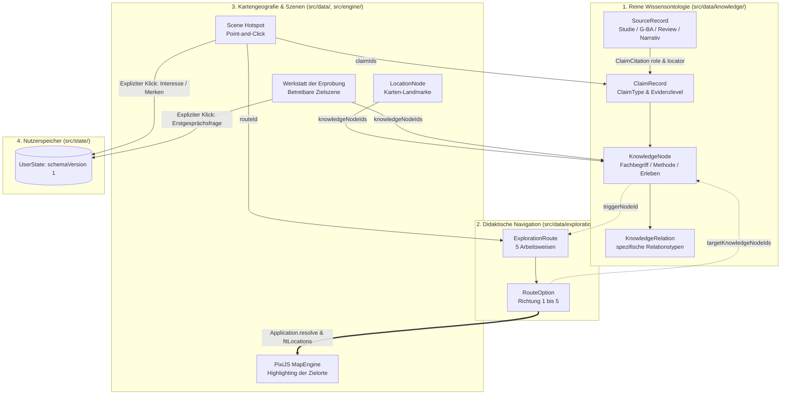

# Implementierungsplan V2.1: Wissens- und Evidenzarchitektur sowie erster Kompasspfad

> **Dokumentenversion:** 2.1 (Freigegeben mit verbindlichen Korrekturen)  
> **Status:** FREIGEGEBEN ZUR DIREKTEN UMSETZUNG  
> **Projekt:** Landkarte der Psychotherapie  
> **Geltung:** Diese Version 2.1 enthält alle verbindlichen Vorgaben aus der Prüfung und bildet die exakte Grundlage für die Implementierung.

---

## 0. Verbindliche Korrekturen & Präzisierungen in Version 2.1

1. **Fachliche Einordnung der 5 Kompassrichtungen (§ 1):**
   * Keine Formulierung als „zentrale Wirkdimensionen“.
   * Verbindlicher Text: *„Die fünf Richtungen sind redaktionell ausgewählte, sich überschneidende Erkundungsperspektiven. Sie bilden keine validierte psychologische Taxonomie, keine Rangfolge und kein Verfahren zur Vorhersage der individuell besten Therapie.“*
   * Sichtbarer Kompass-Hinweis: *„Das ist kein Test und keine Therapieempfehlung. Die Richtungen helfen dir, mögliche Arbeitsweisen kennenzulernen und Fragen für ein Gespräch mit einer Therapeutin oder einem Therapeuten zu entwickeln.“*
2. **Knotentypen, Claim-Typen & Discriminated Unions (§ 2, § 3):**
   * Vollständige Definition von `KnowledgeNodeKind` (subjektives Erleben, Bedürfnis/Ziel, gewünschte Arbeitsweise, therapeutischer Prozess, Intervention/Technik, Therapieansatz/Verfahren, Versorgungsinformation, reale Passung/Zusammenarbeit).
   * Einführung von `ClaimType`: `'effectiveness' | 'association' | 'process' | 'definition' | 'care-fact' | 'theory' | 'experience'`.
   * Strikte Trennung von `evidenceLevel` und Informationskanälen (z. B. `not-applicable` für Narrative, Theorie, Versorgung).
   * `HotspotAction` als strikte **Discriminated Union** in TypeScript (`type: 'NAVIGATE_ROUTES'` erzwingt `routeId: string`).
3. **Eindeutige, betretbare Zielszene (§ 5):**
   * Neuer Ort: `loc_workshop` / `scene_workshop` (**„Werkstatt der Erprobung“**) mit minimalistischem SVG-Tableau im Stil der Visual Bible.
   * Betretbar bei Klick auf Landmarke; Richtung 1 hebt diesen Ort hervor.
4. **Reale Passung statt Entweder-oder-Frage (§ 6):**
   * Reflexionsfrage: *„Wie arbeiten Sie typischerweise mit konkreten Übungen oder Aufgaben – und wie prüfen wir gemeinsam, ob das für mich hilfreich ist und passen es bei Bedarf an?“*
   * Speichern rein freiwillig über expliziten Button in der Zielszene in `bookmarks` (`schemaVersion: 1`).
   * Rucksackzähler-Korrektur: `visitedLocations` erhöht nicht mehr den Zähler sichtbarer Rucksackobjekte.
5. **Verlustfreie Persistenz & Recovery (§ 8):**
   * Sicherung korrupter Daten unter `psychotherapie_landkarte_corrupted_recovery_*`, bevor ein Default-Zustand angelegt wird.
   * Keine `any`-Fehlerbehandlung; Catch-Typen sind `unknown`.
   * Dateiimport überschreibt bei Fehlern niemals den laufenden Speicher.
6. **Strikter Release-Gate & Testrunner (§ 7, § 9):**
   * Aufnahme von `vitest` in `devDependencies`.
   * `npm run build` führt verpflichtend `vitest run` und `validateKnowledge.ts` aus.
   * Claims mit `reviewStatus: 'draft'` blockieren den Produktionsrelease (`BLOCKED_BY_DRAFT_CONTENT`).
7. **Pinch-Zoom mit Pointer-Capture & Grenzen (§ 9):**
   * Vollständige Multi-Touch Gestensteuerung mit Pointer-Cache, `pointercancel`, `touch-action: none` und Min/Max-Clamping.

---



---

## 1. Fachliche Einordnung der fünf Kompassrichtungen

Die fünf Richtungen beschreiben redaktionell ausgewählte, sich überschneidende Erkundungsperspektiven:

1. **„Ich möchte konkrete Strategien und Handlungsmöglichkeiten ausprobieren.“**  
   *(Übungen, Experimente, Hausaufgaben, Stuhlarbeit – schulübergreifend in KVT, Gestalt, Systemik)*
2. **„Ich möchte besser verstehen, welche tieferen Muster und Auslöser dahinterstehen.“**  
   *(Biografie, Beziehungsmuster, unbewusste Dynamiken – Psychodynamik, Schematherapie)*
3. **„Ich möchte lernen, meinen Gedanken mit innerem Abstand zu begegnen.“**  
   *(Defusion, Metakognition, Akzeptanz – ACT, Metakognitive Therapie)*
4. **„Ich möchte körperliche Reaktionen und emotionale Blockaden einbeziehen.“**  
   *(Embodiment, Emotionsfokussierung, Atemregulation – EFT, körperorientierte Ansätze)*
5. **„Ich möchte Wechselwirkungen mit meinem Umfeld und meinen Beziehungen betrachten.“**  
   *(Rollen, familiäre Kontexte, Kommunikation – Systemische Therapie, interpersonelle Ansätze)*

---

## 2. Vollständige Interfaces (Auszug)

```typescript
// src/types/content.ts

export type KnowledgeNodeKind =
  | 'experience'    // Subjektives Erleben, Beschwerdemuster (z.B. "Ständiges Grübeln")
  | 'need'          // Subjektives Bedürfnis / Ziel (z.B. "Wunsch nach Orientierung")
  | 'working-mode'  // Gewünschte Arbeitsweise (z.B. "Handlungsorientiertes Ausprobieren")
  | 'process'       // Therapeutischer Prozess (z.B. "Klärung", "Problemaktualisierung")
  | 'intervention'  // Spezifische Intervention / Technik (z.B. "Verhaltensexperiment", "Stuhlarbeit")
  | 'approach'      // Therapieansatz / Verfahren (z.B. "KVT", "Systemische Therapie")
  | 'care-structure'// Versorgungsstruktur (z.B. "Sprechstunde", "Kostenerstattung")
  | 'collaboration';// Passung & Zusammenarbeit (z.B. "Therapeutische Allianz", "Prüfung der Passung")

export type ClaimType =
  | 'effectiveness' // Empirischer Wirksamkeitsnachweis
  | 'association'   // Empirischer Zusammenhang / Prädiktor (z.B. Allianz -> Outcome)
  | 'process'       // Wirkmechanismus / Ablauf
  | 'definition'    // Begriffsklärung / Definition
  | 'care-fact'     // Rechtliche & organisatorische Versorgungsregel
  | 'theory'        // Theoretisches Modell / Konzept
  | 'experience';   // Subjektive Erfahrung / Patientenperspektive

export type CitationRole = 'supports' | 'qualifies' | 'contradicts' | 'background';

export interface ClaimCitation {
  sourceId: string;
  role: CitationRole;
  locator?: string;
  note?: string;
}

export interface ClaimRecord {
  id: string;
  type: ClaimType;
  statement: string;
  publicExplanation: string;
  citations: ClaimCitation[];
  evidenceLevel: EvidenceLevel;
  reviewStatus: ReviewStatus;
  scope?: string;
  limitations?: string;
}
```

---

## 3. Die 10 Implementierungs-Meilensteine

* **Meilenstein 1:** Wissens-, Claim-, Quellen- und Relationsmodell (`src/types/content.ts`, `src/data/knowledge/*`).
* **Meilenstein 2:** Strukturelle Validierung & Testrunner (`vitest`, `src/validation/validateKnowledge.ts`, `tests/*`).
* **Meilenstein 3:** Migration der vorhandenen Szenen (als `draft`).
* **Meilenstein 4:** Generische Quellen- und Evidenzanzeige (`ActionModal.ts`, `dialogue.css`).
* **Meilenstein 5:** Prüfung & Konsistenzcheck Paket A.
* **Meilenstein 6:** Didaktisches Exploration-Modell & Callbacks (`src/data/exploration/*`, `HotspotAction` Discriminated Union).
* **Meilenstein 7:** Vollständiger Kompasspfad (Variante A mit Zielszene `scene_workshop`).
* **Meilenstein 8:** Landmarken-Hervorhebung, `fitLocations()` & Tablet-Pinch-Zoom.
* **Meilenstein 9:** Verlustfreie Persistenz, Recovery-Key & Rucksackzähler-Korrektur.
* **Meilenstein 10:** Testsuite, Build-Gate, Visuelle Tests & Abschlussbericht `docs/IMPLEMENTATION_REPORT_KNOWLEDGE_GRAPH.md`.
